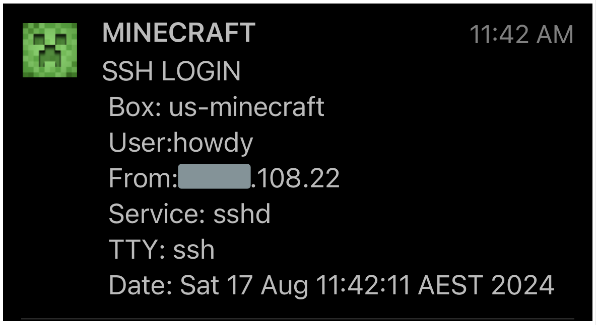
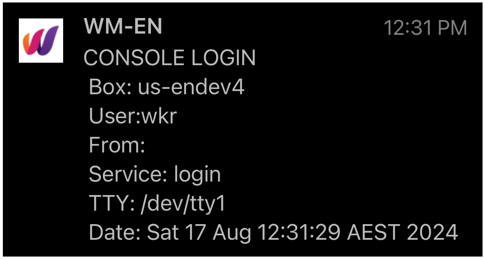

# LOGIN WARN<br>
Sends push message whenever a logon (via ssh/terminal/desktop) containing:<br>
* box name
* connection type (ssh/terminal/gui)
* user logged on as
* timestamp<br><br>
<p float="left">
  
  
</p><br><br>

## COMMON SETUP - Push Message Account + Config file
Create push message account + setup config as per steps here: [push-message-setup](../push-message-setup)<br><br><br>
## NOTIFICATION SCRIPT
### 1: Install curl (if not already)
```bash
sudo apt-get update && sudo apt-get upgrade && sudo apt install curl
```
### 2:  Create notification script<br>
* Common script is triggered by different Ubuntu login PAM (pluggable access modules)<br>
* Use following commands to create script as `/opt/uauto/login_warn/login_warn.sh`<br>
* Create empty file with correct permissions (critical for security)

    ```bash
    sudo mkdir -p  /opt/uauto && \
    sudo chmod 755 /opt/uauto && \
    sudo mkdir -p  /opt/uauto/login_warn && \
    sudo chmod 755 /opt/uauto/login_warn && \
    sudo touch     /opt/uauto/login_warn/login_warn.sh && \
    sudo chmod 700 /opt/uauto/login_warn/login_warn.sh
    ```

* add code into correctly permissioned script

   ```bash
   sudo tee /opt/my_scripts/login_warn.sh > /dev/null <<EOF
   #!/bin/bash
   # LOGIN WARNINGS - Send push message on logins (ssh, terminal, GUI)
   # Script is triggered on sessions start, but could also use "close_session" PAM_TYPE.
   # To prevent anything freezing + locking out logins:
   #  - Loading as PAM optional so hopefully would continue if it failed 
   #  - true condition so push message always succeeds
   #  - curl timeout set in case pushover doesn't respond
   
   # Config file requirements - contains:
   # usrtoken="userkeyuserkeyuserkeyuserkeyzz"   #user key
   # apitoken="apikeyapikeyapikeyapikeyapikey"   #application key
   
   # History:
   # v0.1 - ssd+console notifications
   # v0.2 - add GUI detection for desktop installs
   # v0.3 - move config to shared location
   
   # Parse config details
   config_file="/opt/uauto/uauto.conf"
   msg_priority=1  #1=high,0=standard,-2=silent
   [ ! -f ${config_file} ] && exit
   usrtoken="$(cat $config_file | grep -v ^# | grep usrtoken | awk -F\= '{ print $2}' | awk -F\# '{ print $1 }' | sed 's/ //g' | tr -d '"')"
   apitoken="$(cat $config_file | grep -v ^# | grep apitoken | awk -F\= '{ print $2}' | awk -F\# '{ print $1 }' | sed 's/ //g' | tr -d '"')"
   [ -z $usrtoken ] && exit 
   [ -z $apitoken ] && exit 
   
   # Notification
   if [[ "$PAM_TYPE" == "open_session" ]]; then
             # Is this console or ssh?  Is triggered from both
             if   [ "$PAM_SERVICE" == "sshd" ];         then LoginType="SSH"
             elif [ "$PAM_SERVICE" == "login" ];        then LoginType="CONSOLE"
             elif [ "$PAM_SERVICE" == "gdm-password" ]; then LoginType="GUI"
             else LoginType="MYSTERY"
             fi
             #Construct message
             PO_MSG="$LoginType LOGIN\n Box: `uname -n`\n User:$PAM_USER\n From:$PAM_RHOST\n Service: $PAM_SERVICE\n TTY: $PAM_TTY\n Date: `date`"
   
             #Send notification
             curl -s --connect-timeout 5 \
                   --form-string "user=${usrtoken}" \
                   --form-string "token=${apitoken}" \
                   --form-string "priority=${priority}" \
                   --form-string "message=`echo -e $PO_MSG`" \
                   https://api.pushover.net/1/messages.json > /dev/null 2>&1 || true
   fi
   exit 0
   EOF
   ```
<br><br>
## LOGON TRIGGERS
### 1:  SSH trigger<br>
* Edit sshd PAM:

   ```bash
   sudo nano /etc/pam.d/sshd
   ```
* add line at end + save:

   ```bash
   session    optional     pam_exec.so /opt/my_scripts/login_warn.sh
   ```
<br>

### 2:  Console/Terminal trigger<br>
* Edit login PAM:

   ```bash
   sudo nano /etc/pam.d/login
   ```

* and line near end above final 3x @include calls:

   ```bash
   session    optional   pam_exec.so    /opt/my_scripts/login_warn.sh
   ```
<br>

### 3:  GUI Login trigger (desktop Ubuntu)<br>
* N/A for cli only servers, this trigger is only for Ubuntu desktop GUI panels
* Edit relevant PAM:

   ```bash
   sudo vi /etc/pam.d/gdm-password
   ```
* add line near end (just above final @include common-session):

   ```bash
   session optional        pam_exec.so /opt/my_scripts/login_warn.sh
   ```
