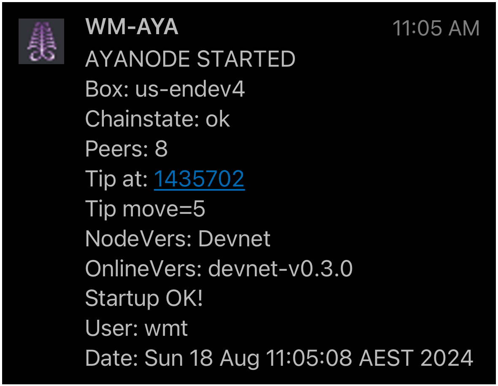
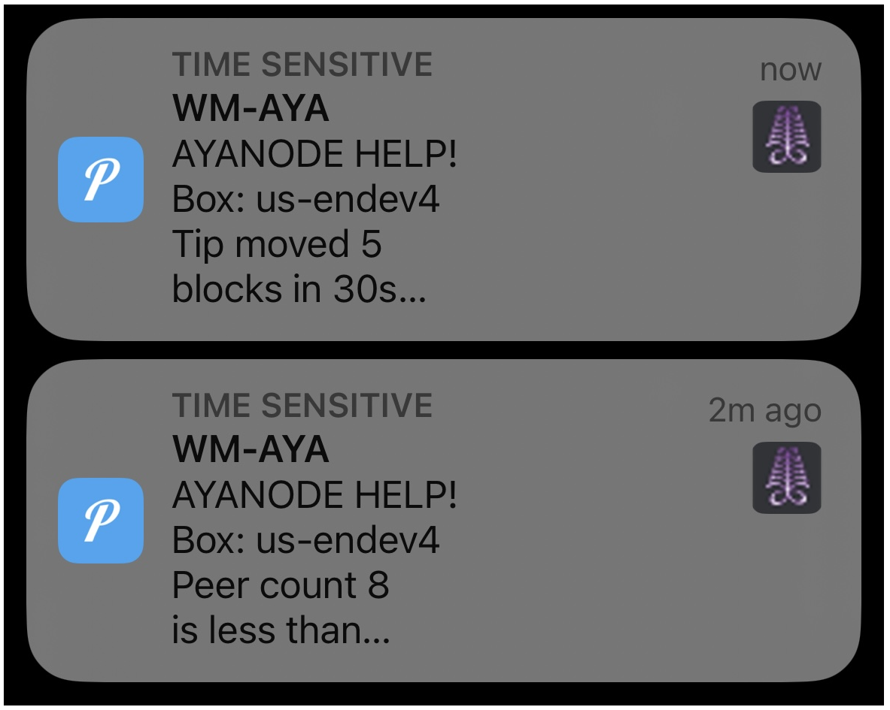
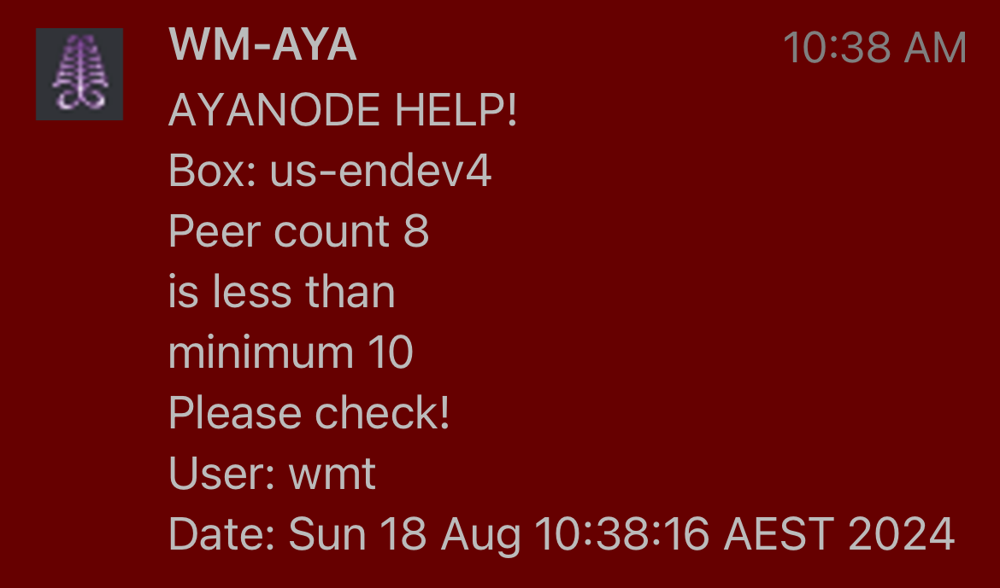
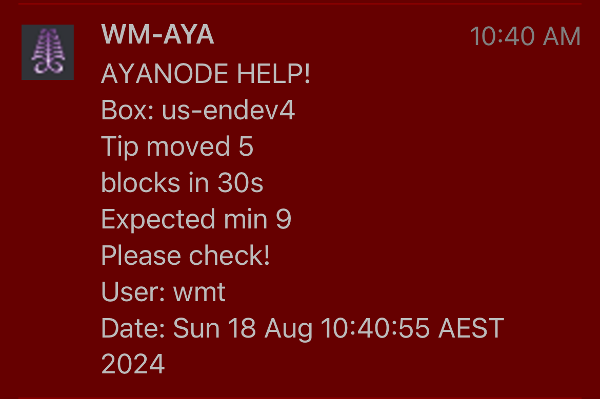

# MONITOR WM-AYA
Watches over state of World Mobile AYA chain and updates via push message:
* startup ok
* daily once a day update if ok (default silently)
* Issues:
   * tip not progressing fast enough
   * too few peers
   * new version of node online (disabled currently)
<br>

<p float="left">
  &nbsp;&nbsp;
  
  &nbsp;&nbsp;&nbsp;&nbsp;&nbsp;&nbsp;&nbsp;
  
</p>
<br>
<p float="left">
  &nbsp;&nbsp;
  
  &nbsp;&nbsp;&nbsp;&nbsp;&nbsp;&nbsp;&nbsp;
  
</p>
<br>

## OVERVIEW
* Works in conjunction with [patcher.sh](../../patcher) + [monitor_external](../monitor_external)
* Patcher will notify on shutdown why rebooting, and this script notifys chain state on bootup + monitors ongoing
* Watches chainstate (syncing or not)
* Watches for node updates becoming available
* Maintains log file of ongoing detections
* User specified variables contain limits for:
   * minimum acceptable number of peers
   * minimum blocks the chain tip should advance in specified seconds (default 10 in 300s)
<br>

## MINIMISING NOTIFICATIONS
* This script under stable/ok running will provide zero visible notifications
* It sends a silent message once a day at user specified time (no slideover - but will be in phones history+contain stats)
* Awareness the box is up (ie not crashed+silent for wrong reasons) is performed by [monitor_external](../monitor_external)
* External monitors will advise within a few minutes if the AYA box is not responding
* This script will notify within 300seconds if it finds any AYA chain issues
* If issue state persists, message repeats hourly until resolved - then back to no visible messages
* On startup a visisble message is sent (providing awareness post automated patching/reboot)
* External monitors are also silent (with exception of once a day message noting they are up)
<br>

## PRECURSORS
* presumes
   * [common_setup](../../common_setup) has been performed
   * AYA installed and starts ok
   * running as wmt user (non-sudo enabled) from home directory
<br>

## SETUP
* Create script file `/home/wmt/monitor_aya.sh` with correct permissions and open for edit:
   ```bash
   touch     /home/wmt/monitor_aya.sh && \
   chmod 700 /home/wmt/monitor_aya.sh && \
   nano      /home/wmt/monitor_aya.sh
   ```

* Copy the raw [monitor_aya.sh](./monitor_aya.sh) script using "raw-copy" button at top-right just above script, paste into editor and save/exit
<br>

## SCHEDULING
Open contab:
```bash
crontab -e
```
and add line to start at bootup:
```bash
@reboot /home/wmt/monitor_aya.sh >> /home/wmt/cronlog_test.log 2>&1
```
