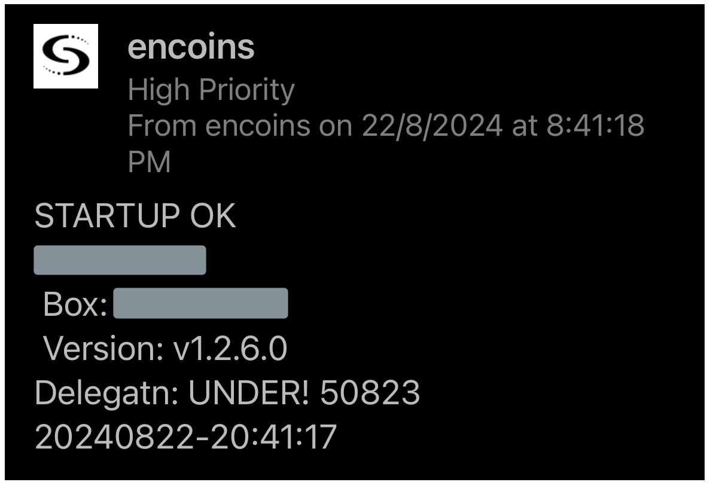

## MONITOR ENCOINS light server
* Uses light server in minimalist format - hosted on 1core/1GB ram/25GB disk
* Requires Maestro subscription
* Runs as crontab scheduled job on non-sudo user which installed encoins server
   * `crontab -e` and `@reboot /home/encoins/monitor_encoins >/dev/null 2>&1` or similiar
* Script is earlier generation and needs update when Encoins v2 is out to bring it into line with other automation
* Complete automation currently disabled
   * last update of light server from v1.2.5->v1.2.6 broke formats for automated node binary updating
   * For now user variable for update type set to "m" - manual => will notify if there is a new binary but not install it

## OVERVIEW
* Box has been 100% on autopilot for 6months while no encoins node updates - required zero intervention
* a few messages as it patches/reboots itself + would have notified immediately if logged onto
* 202408 - added delegation amount into messages thanks to Carrotshade :-)

  

  &nbsp;&nbsp;&nbsp;&nbsp;&nbsp;
  

  
