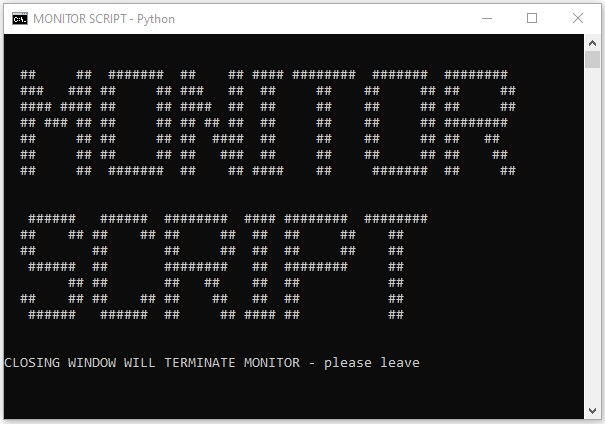

# MONITOR - EXTERNAL
A crashed/disconnected box can't notify of issues - so it is necessary to run other external monitoring to slice back through the environment from different directions providing a web of issue detection.<br>
<br>
Example config: [monitor_config.py](./monitor_config.py)  Also configurable to monitor websites up, network drives online etc.<br>
<br>

## SCRIPT STRUCTURE
The 2 python scripts are for linux/windows, plus extra batch file to schedule on windows:
* `monitor_config.py` - python script containing all variables/config
* `monitor.py` - generic script same for any installation - only change the config
* `monitor.bat` - windows only - used to call python/script when scheduled
<br>

## REQUIRED

| OS     | Required                      |
| :----- | :---------------------------- |
|Linux   | `sudo apt install python3-pip`|
|Linux   | `pip3 install requests`       |
|Windows | install python [python.org/downloads](https://www.python.org/downloads/) |
|Windows | `pip3 install requests` |
<br>

# CONFIGURATION
* The monitor_config.py requires python syntax (main monitor.py script will call it)
* Config can be updated while script is running no need to stop, as reloads each scan
* That's unless in wait period between notifications due to recent error message + don't want to wait
* Script can run online/manually if required - from command line:  python3 monitor.py
* To verify scan groups are processing as expected, use the testing variable in monitor.py + run from command line
   * `testing = 0` - no screen output, normal running mode
   * `testing = 1` - prints to screen summary of process.  Run manually/online only:  `python3 monitor.py`
<br>

## CONFIGURATION - BASIC VARIABLES
Basic variables are at the start of monitor_config.py.<br>

These cover:<br>
**`MONITOR_LOCATION`** - there are 4 setup for different locations/accesses that a monitor machine may have:
   * **INTERNAL** - on Lan but not mapped drives, ideally connected to router (no switches inbetween), plus no VPN
   * **HOSTED**  - outside network eg hosted.  On different power supply+network
   * **WINONLAN**  - windows box on local network.  On VPN if self hosting + nodes on different VLAN
   * **TAILSCALE** - on tailnet/secure network with ACL configured to see all boxes<br>

**`SLEEP_PERIOD`** - seconds between next config load+rescan (default 300/6min)<br>

**`HOUR_OF_DAY_FOR_LOW_PRIORITY_MSG`** - hour to send once a day message, will be within SLEEP_PERIOD time after it<br>

**`USR_TOKEN`** - pushover user api key<br>

**`API_TOKEN`** - pushover application api key<br>
<br>

## CONFIGURATION - SCAN GROUPS + DETAIL
The different boxes and methods to remotely monitor them are detailed in monitor_config.py after the basic variables, in the form of python arrays.  If copying and pasting lines, ensure last array data record trailing comma missing (only).  The main script will notify of simple format errors, but not all syntax issues.

**Priority** - each scan group has 3 levels of notification priority values (1,2,3):
1. critical - hourly message
2. fix_sometime - in daily message at hour you specify
3. supress/ignore - leave record in config, but don't process it
<br>

### SCAN GROUP - INTERNAL_IPs
Checked for `MONITOR_LOCATION = INTERNAL` + `MONITOR_LOCATION = WINONLAN`
Fields:
* `ip_address` - for local scans, on same subnet
* `device_type` - eg abbreviated rtr (router), sw(switch) or whatever suits
* `shortname` - node name (intended to read from watchface)
* `priority` - 1,2,3
<br>

### SCAN GROUP - EXTERNAL_IPs
External - means external public world facing address of node to be monitored.  To scan from on the box use the specific project scripts.<br>
The scan_groups <--> monitor_location here are more involved and originate from INTERNAL = no VPN, and WINONLAN:
* `MONITOR_LOCATION = INTERNAL` - **partial check - only if** `SELF_HOSTING = 'N'` - due to inability to look inside own external ip address if on segrated VLANs
* `MONITOR_LOCATION = WINONLAN` - checks everything
* `MONITOR_LOCATION = TAILSCALE` - checks everything
* `MONITOR_LOCATION = HOSTED` - not on local network, eg hosted - checks everything
<br>
Fields:
* `ip_address`
* `node_name`
* `node_public_ip`
* `node_port_number`
* `detection type` - **www/json/port** - websites, json header, port open check
* `priority` - 1,2,3
<br>

### SCAN GROUP - TAILSCALE
Only checked for `MONITOR_LOCATION = TAILSCALE` - somewhere that has access to full tailscale network (can optionally hide reverse visibility from nodes using tailscale ACL).  To be merged with EXTERNAL_IPs group as currently only basic ping over tailscale.<br>
Fields:
* `project` - high level group, eg aya, wmc, iagon, etc
* `ip_address` - tailscale ip address to scan
* `node_name`
* `priority` - 1,2,3
<br>

### SCAN GROUP - NETWORK SHARES
Only checked for `MONITOR_LOCATION = WINONLAN` - purpose being to verify network availability, in case Windows box rebooted + drives locked = prevents backups etc.
Fields:
* `ip_address` - local network ip
* `name` - name of windows box
* `drive_share` - will be catenated onto ip address to check
<br>

## SCHEDULING
Run under Windows Task Manager, and set up a service on Ubuntu.  Make sure Required steps are completed first, and have testing online from python command line.<br>
<br>

### WINDOWS
Copy the 3 files into a folder eg C:Temp\_Scheduled_tasks\monitor
* [monitor.bat](./monitor.bat) - windows batch file to initiate python
* [monitor.py](./monitor.py) - called by batch file
* [monitor_config.py](./monitor_config.py) - called by monitor.py<br>
Use Windows task scheduler to create a task as per regular usage.  For this generation trigger by windows user logon (not pc startup - until rewritten as a windows service).<br>
<br>
This will start a DOS window, which has to be left open:<br>
<p float="left">
  
</p><br>

### UBUNTU
Create as a systemd service as per following or similar:<br>
* `sudo mkdir -p /opt/uauto/monitor && sudo chmod 755 /opt/uauto/monitor`<br>
* Copy 2 python files into a folder eg /opt/uauto/monitor<br>
   * [monitor.py](./monitor.py) - main script
   * [monitor_config.py](./monitor_config.py) - called by monitor.py<br>
* `chmod 700 *py`
* `sudo vi /etc/systemd/system/monitor.service`
* paste in:
    ```bash
     Description=Monitor service
     #After=multi-user.target
     After=network.target
    
     [Service]
     User=<user_python_modules_installed_as-maybe_root>
     Type=simple
     Restart=always
     RestartSec=60
     WorkingDirectory=/opt/uauto/monitor
     StandardOutput=file:/opt/uauto/monitor/stdoutput.log
     ExecStart=/usr/bin/python3 /opt/uauto/monitor/monitor.py
     ExecReload=/bin/kill -s HUP $MAINPID
     KillSignal=SIGINT
     
     [Install]
     WantedBy=multi-user.target
     ```
* change the user in above, _possibly_ will have to be root depending on how python was installed. Restrict access to scheduled scripts running with elevated privileges
* start it:
     ```bash
     sudo systemctl daemon-reload && sudo systemctl enable monitor.service && \
     sudo systemctl start monitor.service && systemctl status monitor.service
     ```
