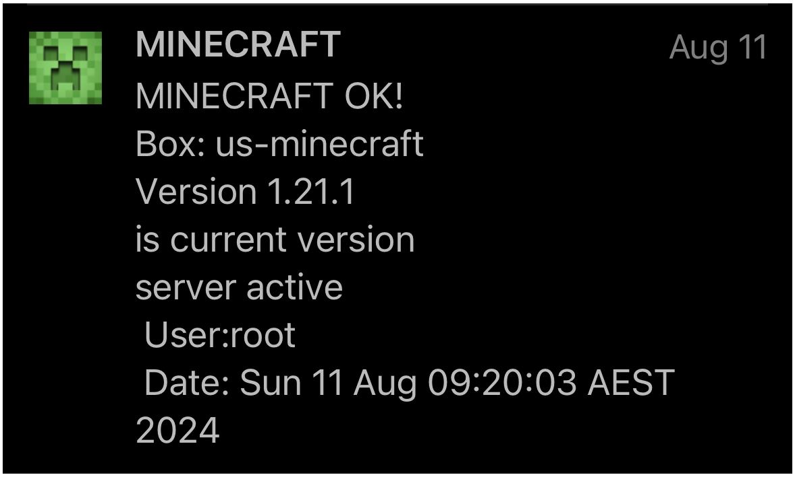

## MONITOR MINECRAFT SERVER
* check for updated versions of Microsofts Java Minecraft server jar file + notify if existing
* Check server starts OK on reboot and notifies
* Default configuration is silent messages if all ok, and saves pinging for updated version available or issue detected
<br>
<p float="left">
  
</p>
<br>

### REQUIREMENTS
* Ubuntu:  `sudo apt install p7zip-full jq python3-pip`
* Python:  `pip install requests beautifulsoup4`
<br>

### SETUP - NB older gen script using /opt/my_scripts + secrets.txt instead of uauto folders
* won't be updated to current uauto gen so patcher is still autobox era
* check through variables section near start of shell script to check what you need to change
* eg - expects `/opt/my_scripts/autobox/secrets.txt` instead of `/opt/uauto/uauto.conf` (but same file), change location in variable
* set path to python web scraper in variable according to where you store it also
<br>

### SCHEDULING
Use two entries in crontab, one to trigger on bootup and other normal daily running:  `crontab -e`
```bash
20 9 * * * sudo /opt/my_scripts/minecraft/minecraft_check.sh
@reboot sudo /opt/my_scripts/minecraft/minecraft_check.sh "rbt"
```
