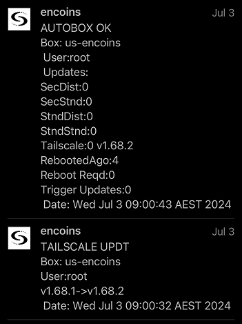
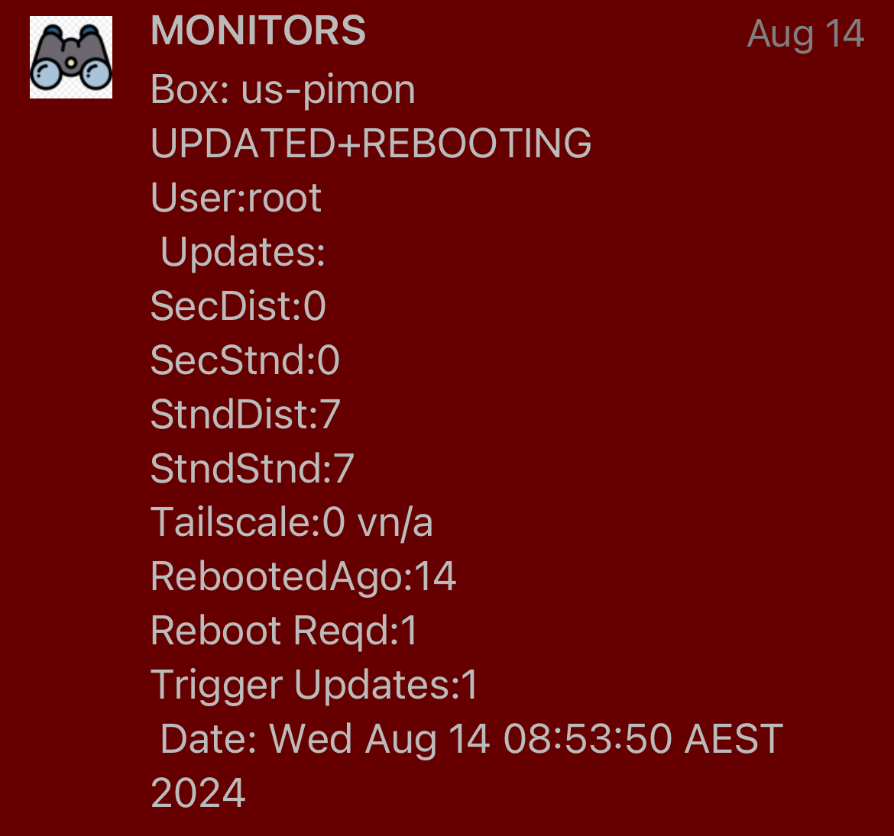

# PATCHER - Automated Ubuntu patching/rebooting<br>
Relies on unattended-updates for background silent patching, then manages reboots when needed.<br><br>
### Overview:<br>
* Tested on Ubuntu 22.04
* Only for simple boxes, where if prompted you always select the defaults
* Requires needsupdate + unattended-updates packages
* Does not reboot unless unattended updates flags it as required (or user set number of days since last reboot is exceeded)
* Reboots (and applies any other updates queued) when unattended updates has flagged reboot is required
* Will attempt to stop service on config before updating/rebooting
* Push message account + config has to be setup per [common_setup](../common_setup)
* Script whitelisted for non sudo password prompting so it can be fully automated
   * This requires careful attention to permissions for security
* OpenSSH server and tailscale are updated immediately if patch available
* GRUB (bootloader) updates will NOT be applied + script will not reboot + will message to update manually
* Requires suppression of all pop-up prompts that would halt automation (will default to agree with everything)
<br>

### Messages:
* Once a day
* If no action message is silent (is in message history, but not notified onscreen)
* If reboot being triggered message is not silent and provides reason why
* Priority level variable can changed in the script, above is only default settings
* Messages only relate to patching, liveliness of box/node is via [monitors](../monitors)
* Monitors are two forms
   * on box - maintaining awareness of running state
   * external to box - looking back at it from other network locations
* Unapplied update counts are split 4ways into Distribution-Standard+Security, and Standard-Standard+Security
* Counts go up/down day to day, as depending on this script+unattended updates schedules they may accrue/be successfully applied
<br>

### SAMPLE MESSAGES
Messages will provide 
* counts of security+standard patches broken into standard and dist groups
* days since last reboot
* whether reboot was required
* send tailscale version information
* etc<br><br>
<p float="left">
  
  
</p>


# CONFIGURATION
### SECURITY
Ensure only the sudo user running the task can edit the script and no other user has access.<br>
This mitigates privilege escalation risk where lower access user adds line in automated script<br>
to give themselves higher access next time it runs.<br><br>
Using 3 users also compartmentalises breach scope in event of node software security issue:
* sudo user - schedules scripts like this/setup services/sudo tasks, no ssh access
* service user - no sudo, but runs the node/job the box is there for, no ssh access
* access user - no sudo, ssh in via this user (its only purpose)
<br>

### REQUIRED PACKAGES:
These may already be installed, but if not:
```bash
sudo apt update && sudo apt upgrade && \
sudo apt install -y needrestart unattended-upgrades
```
If unattended-upgrades not running:
```bash
sudo dpkg-reconfigure --priority=low unattended-upgrades
```
<br>

### SCRIPT CREATION:
* Create empty script file `/opt/uauto/patcher/patcher.sh` with correct permissions (run as your sudo user):
   ```bash
   sudo mkdir -p  /opt/uauto/patcher && \
   sudo chmod 755 /opt/uauto/patcher && \
   sudo touch     /opt/uauto/patcher/patcher.sh && \
   sudo chmod 700 /opt/uauto/patcher/patcher.sh && \
   sudo nano      /opt/uauto/patcher/patcher.sh
   ```

* Open the raw [./patcher.sh](https://raw.githubusercontent.com/bnchk/uauto/main/patcher/patcher.sh) script, copy+paste into editor and save/exit
<br>

### VARIABLES:
Low importance but can:
* Edit max_days_without_reboot variable.  Default is 21, but has never been reached as reboots usually trigger ~10-14 days
* Run beta_code = y/n - default of yes will update to openssh_server (but has been stable for last couple of updates)
   * Previously unexpected confirmation popup caused package manager to freeze waiting for prompt, but script now checks for this scenario having occured (plus messages command to release package manager)
<br>


### PROMPTED CONFIRMATION SUPPRESSION:
With full automation, there can be no DOS style popups asking for anon-existent human to respond, eg "what processes you want restarted?" / "What to do with outdated daemons?".<br><br>
The following will force defaults and no prompting.
* Change outdated Daemons config to force defaults (UNcomment + change i->a so #$nrconf{restart} = 'i';  ==> $nrconf{restart} = 'a'):
```bash
sudo sed -i "/#\$nrconf{restart} = 'i';/s/.*/\$nrconf{restart} = 'a';/" /etc/needrestart/needrestart.conf
```
* Kernel updates notification (UNcomment this line - $nrconf{kernelhints} = -1;)
```bash
sudo sed -i "/#\$nrconf{kernelhints} = -1;/s/.*/\$nrconf{kernelhints} = -1;/" /etc/needrestart/needrestart.conf
```
<br>

### WHITELIST SCRIPT RUNNING (passwordless sudo):
Rather than have passwordless sudo enabled, only the script is whitelisted for sudo without password prompt (required so automation can run on its own).<br>
This is why permissions security around it is important.  To whitelist the script:
```bash
sudo visudo
```
Add this line at end replacing youruser with the user scheduling script, plus change path/scriptname if you modified location:<br>
```bash
youruser ALL=(ALL) NOPASSWD: /opt/uauto/patcher/patcher.sh
```
<br>

### SCHEDULING:
Add to crontab
```bash
crontab -e
```
Enter a run schedule at end or crontable again changing script name/location if required, eg for 8:30am:<br>
```bash
30 8 * * * sudo /opt/uauto/patcher/patcher.sh
```
Notifications after a reboot is triggered are handled by the [monitors](../monitors)
