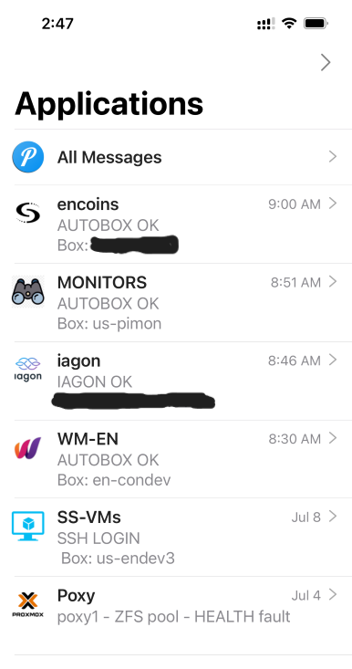

# uauto - ubuntu automation 
A collection of simple scripts to run simple boxes on their own. 
Also written by a simpleton, so comes with all the usual warnings.. 
The tasks have been keeping a variety of basic boxes/nodes running on their own, with as few communications as possible. 
Not intented for complex boxes - eg buildingfrom source with dependencies, or that run tight on RAM/CPU. 
But for something simple where you always click yes on updates, this may assist. 
Any feedback/suggestions most welcome.  
All scripts require setup of push message account as per [push-message-setup](https://github.com/bnchk/UbuntuAutomation/tree/main/push-message-setup)   

## Scripts cover: 
* [logon notifications](https://github.com/bnchk/UbuntuAutomation/tree/main/logon-notifications) (ssh/terminal/gui) 
* [autobox](https://github.com/bnchk/UbuntuAutomation/tree/main/autobox) (patching/rebooting) 
* [ZFS pool monitoring](https://github.com/bnchk/UbuntuAutomation/tree/main/zfs-health-check) (disk raid array checking)  

## Scripts work in progress: 
* monitoring (network/unresponsive boxes/locked drives etc) 
* node project update automation (automate updating of projects)  

## Pushover app messages: 
There are a suprising number of ways to interface to the pushover app, including having NAS advise when it finds updates. 
Messages can be grouped (called applications) as per screenshot below.  They also can have priority assigned, so they are silent/standard/require acknowledgment.  All convey issue in header lines = easily read from watchface.  
Default settings for no issues across all scripts takes about 10seconds/day for ~8boxes, with only non silent message being monitoring machines once a day.  
Messages are sent if something of note is happening (eg reboot for udpates/new version of project software being applied/raid failure, network switch down, box not responding to pings/no json response/box logged onto/etc). 
todo - check - Package update messages may also be silent now, with reboot startup messaging left to the project service automation notifying its status as it comes online (or not). 
For major issues requiring immediate human attention - messages are every hour until resolution auto-detected/messages cease.  This can be changed if needed.  
   

## Future ideas: 
* if excess RAM usage/disk space issues etc, add more notification 
