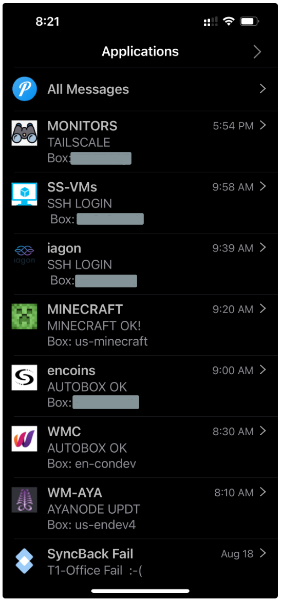

# uauto - ubuntu automation 
Scripts to automate simple nodes, covering: 
* [logon notifications](./login_warn)
* [patching](./patcher) - keep node up to date
* [monitoring on node](./monitors)  - does node seem stable
* [monitoring from externally](./monitors/monitor_external) - is node visible/responding
* [zfs raid pool monitoring](./monitors/monitor_zfs) - drive failures
* communications - via push message ([once off $5 account](https://github.com/bnchk/UbuntuAutomation/tree/main/push-message-setup)) - issues/daily summary/whats happening/manual help needed/etc 
  
## Push Messages
Message levels are configurable, but default only 1 notifications per monitors each morning.
If something goes wrong, messages are sent within few minutes from monitors/nodes and continue to be informed hourly until it is resolved.
Daily summary messages are sent from each node under ok running, but default is silent.  They can be found in push message app if required, or turned to ping as they arrive. 
 
Following is standard example of morning messages with: 
* Iagon node updating tailscale (no reboot required)
* AYA node advising it's version is not the same as online
* Monitors all ok
  

  
  &nbsp;&nbsp;&nbsp;&nbsp;&nbsp;
  

## Notes
* Communication defaults are bare minimum, but can be tweaked via settings
* All messages are designed to have gist conveyed within watchface size area
* Not for complex boxes - eg building from source with dependencies, or running tight on RAM/CPU
* Intended for simple boxes where you always click yes/defaults on everything
* Prometheus/Grafana are vastly more capable, this is intended to complement that
* Automated scripting requires security attention to prevent facilitating privilege escalation capability
* Use on devnet/testing until comfortable they are ok/use at own risk etc
* Any feedback/suggestions welcomed
