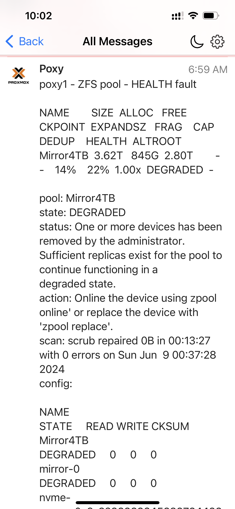

# ZFS pool health monitor script<br>
This script monitors the status of the array/pool for issues.<br><br>
It was copied from [petervanderdoes/zfs_health.sh](https://gist.github.com/petervanderdoes/bd6660302404ed5b094d) gist v0.15 and updated to his current v0.18 from his website Calomel.org.<br><br>
Subsequently it was converted to communicate via push message instead of email.<br><br>
To run the script copy to your preferred location:<br>
eg `/opt/my_scripts/zfs_health_check.sh`<br><br>
Edit script to replace 2 dummy api keys (lines 14/15) with ones from setup of your [pushover account](https://github.com/bnchk/UbuntuAutomation/tree/main/push-message-setup).<br>
Alternately with existing pushover account, you could create a new application/api key if ZFS messages are to be grouped separately.<br>
This is where in the script you replace your keys:<br>
```bash
# Pushover.net push message api keys (update with your ones)
pushover_user_key="userkeyuserkeyuserkeyuserkeyuserkeyuserkey"
pushover_app_key="appkeyappkeyappkeyappkeyappkeyappkeyappkey"
```
Schedule from cron:<br>
eg edit schedule `crontab -e`<br>
add a line at end to suit your preference eg daily 6am:<br>
`* 6 * * * /opt/my_scripts/zfs_health_check.sh >/dev/null 2>&1`<br><br>
<br>
Always make sure the permissions for the scheduled script are such that if running as privileged user, no lower level user has permissions to edit the automated script and add a line to increase their privilege:<br>
eg `chmod 700 /opt/my_scripts/zfs_health_check.sh`<br><br>
Messages are designed to fit first line/summary on watch face.<br>
Following is full message in pushover app when half of raid1 mirror failed in Proxmox server called poxy1:<br><br>
 <br>
